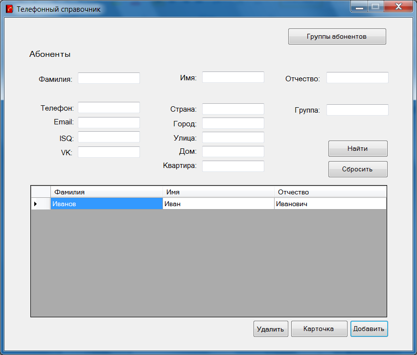
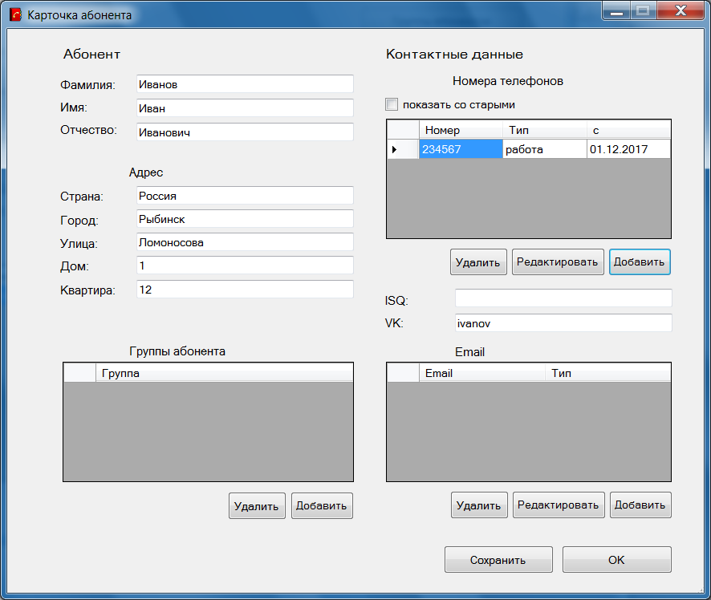

# Телефонная книга частного лица

Номер регистрации (свидетельства):
[2019666105](https://www1.fips.ru/registers-doc-view/fips_servlet?DB=EVM&rn=5985&DocNumber=2019666105&TypeFile=html)

---

### Название программы для ЭВМ:
Телефонная книга частного лица

### Реферат:
Программа является графическим приложением. Реализует телефонный справочник частного лица. Предназначена для хранения информации об абонентах, их номеров телефонов, а также дополнительной информации. Предоставляет пользователю средства для просмотра базы абонентов и ее редактирования. Обеспечивает поиск нужного телефона по имеющимся параметрам, например, по фамилии или имени, в различных категориях: друзей, деловых партнеров, родственников и т.д. Возможен также обратный поиск абонента по номеру телефона. Программа учитывает наличие у одного лица нескольких номеров телефонов: рабочих, домашних, мобильных. Справочник хранит историю смены номеров и предоставляет возможность поиска по старому номеру. Тип ЭВМ: IBM PC-совмест. ПК. ОС: Windows.

### Язык программирования: 
С#

### Объем программы для ЭВМ: 
339 Кб

---

## Презентация

[Телефонная книга частного лица](отчет_27.12.17_Грушевская_ИТ-31БО_6.pdf)

---

## Интерфейс

    

    

